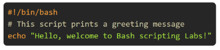
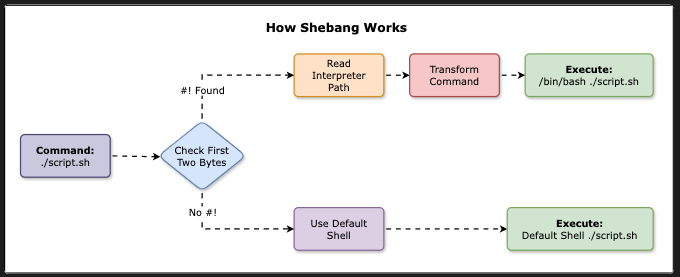

## Goal
How to `Create`, `Execute` and `Understand` simple bash script.



## Step 1 : Creating first bash script
### Script Name: greetings.sh
A bash script is a file containing a sequence of commands that are executed in order. Let's create a simple script that prints a greetings message. First, what is a shebang line? 
`#!/bin/bash` is the first line of bash script that tells the OS which interpreter to use to execute the script.



## Step 2: Make the script executable
`chmod +x greetings.sh`

## Step 3: Running the script
`./greetings.sh `

## Step 4: Accepting user input
Update the script `greetings.sh` as below: 
```
#!/bin/bash 
# This script takes user input and prints a personalized greetings message 

echo "Enter your name: "
read name
echo "Hello, $name! Welcome to Bash Scripting Lab."
```