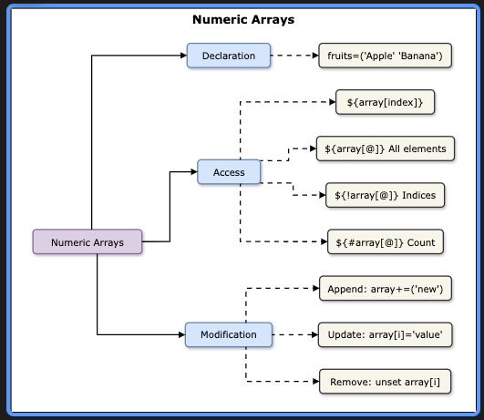
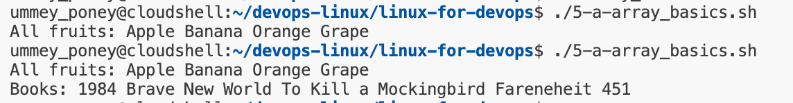
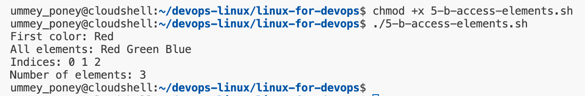
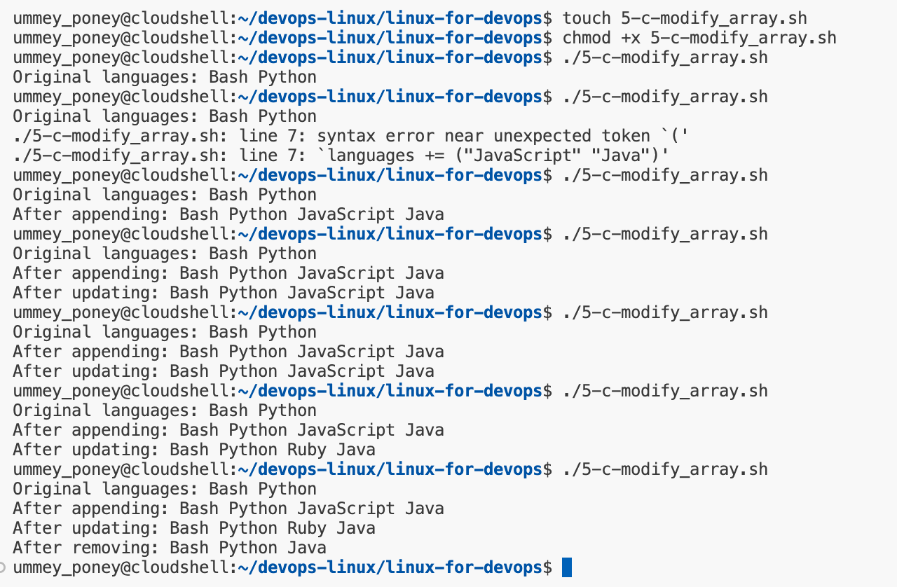
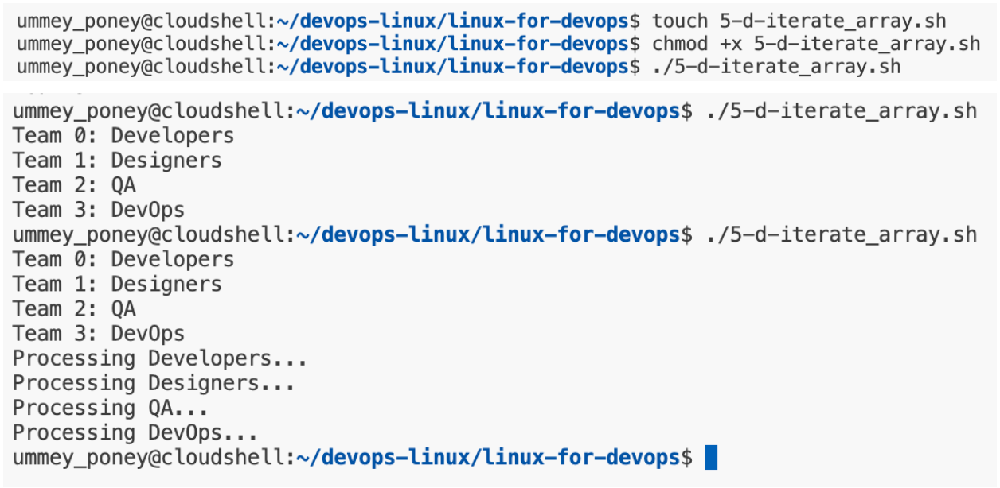
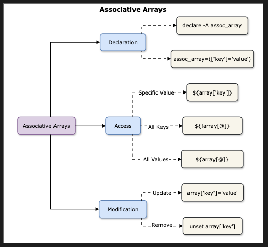
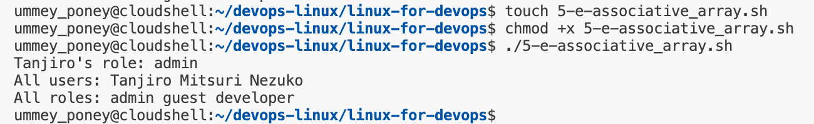

# Arrays in Bash Scripting
## Goal
Learn how to declare, manipulate, and iterate over arrays for scripting. 


By the end of the lab, the goal is to be able to accomplish following tasks: 
- Declaring and initializing arrays
- Accessign array elements
- Modifying arrays (adding, removing, updating)
- Iterating through arrays
- Using associative arrays (Bash 4+)

## Declaring and Initializing Arrays
### Basic Array Declaration
Create a script array_basics.sh: 
```
#!/bin/bash

# Declare an array of fruits
fruits=("Apple" "Banana" "Orange" "Grape")

# Print all elements 
echo "All fruits: ${fruits[@]}" 

# Declare an array with spaces/newlines
books=(
    "1984"
    "Brave New World"
    "To Kill a Mockingbird"
    "Fareneheit 451"
)
echo "Books: ${books[@]}"
```


### Accessing Array Elements
Access elements in array using indices (starting at 0):
#### Example Indexing and Properties
Create access_elements.sh 
```
#!/bin/bash

colors=("Red" "Green" "Blue")

echo "First color: ${colors[0]}"
echo "All elements: ${colors[@]}"
echo "Indices: ${!colors[@]}"
echo "Number of elements: ${#colors[@]}"
```


### Modifying Arrays
Add, update, or remove elements dynamically: 
#### Example: Adding and Removing Elements
create 5-c-modify_array.sh
```
#!/bin/bash

languages=("Bash" "Python")
echo "Original languages: ${languages[@]}"

# Append elements
languages+=("JavaScript" "Java")
echo "After appending: ${languages[@]}"

# Update an element
languages[2]="Ruby"
echo "After updating: ${languages[@]}"

# Remove the third element (index 2)
unset languages[2]
echo "After removing: ${languages[@]}"
```


### Iterating Through Arrays
Loop through arrays using for loops:
#### Example: Iteration Methods
Create 5-d-iterate_array.sh
```
#!/bin/bash

teams=("Developers" "Designers" "QA" "DevOps")

# Loop with indices
for i in "${!teams[@]}"; do 
    echo "Team $i: ${teams[i]}"
done

# Loop through elements directly
for team in "${teams[@]}"; do 
    echo "Processing $team..."
done
```


## Associative Arrays (Bash 4+)
An associative array in Bash is a type of array that allows to use string keys instead of just numeric indices. This means values can be stored and retrieved using meaningful names rather numbers/indices. 



### Syntax
```
declare -A my_array
```
- declare -> used to define a variable
- -A -> Tells Bash that my_array is an associative array. 
#### Example: Key-Value Storage
Create associative_array.sh
```
#!/bin/bash

declare -A user_roles
user_roles=(
    ["Tanjiro"]="admin"
    ["Nezuko"]="developer"
    ["Mitsuri"]="guest"
)

echo "Tanjiro's role: ${user_roles["Tanjiro"]}"
echo "All users: ${!user_roles[@]}"
echo "All roles: ${user_roles[@]}"
```
