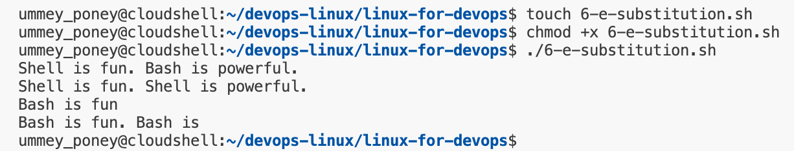

# String Operations in Bash Scripting
Working with strings is a crucial skill in Bash Scripting, that enables to handle text efficiently for automation, data processing, and system administration tasks. This lab walks through essential string operations, from basic to declaration to advances manipulation techniques. 

## Goal
To be able to :
- Declare and print strings
- Concatenate and measure string length
- Extract substings and perform replacements
- Trim whitespaces and convert cases
- Split strings into arrays
- Check for substrings and empty strings

## Basic String Declaration and Printing
### Script: strings_basics.sh
```
#!/bin/bash

# Declare Strings
str1="Bash"
str2="Scripting"
str3="Hello, World!"

# Print Strings
echo "$str1 $str2"
echo '$str1 $str2'
echo "$str3"
```
In Bash, double quotes (" ") and single quotes (' ') are both used for defining strings, but they handle variables differently: 
- Double quotes (" "): Allows variable interpolation, meaning variables inside the quotes will be replaces with their values. 
- Single quotes (' '): Treats everything literally, meaning instead of accessing with values of the variables it will preserve the literal value of each character within them. The shell will not interpret or expand the variables inside it.


## String Concatenation
String concatenation joins multiple strings together, either from variables or literals. 
### Sciript: concatenate.sh
```
#!/bin/bash

first="Inosuke"
second="Hashibira"

combined="$first $second"
echo "$combined"
echo "$first $second is a half-demon among demon slayers."
```
- Strings can be concatenated directly using variable expansion ($var).
- Spaces must be explicitly included where needed. 


## String Length Calculation
Use ${#variable} to determine the length of the string.
### Script: string_length.sh
```
#!/bin/bash

str="Kocho Shinobu"
echo "Length of '$str': ${#str}"
echo "Length of '$str $str': ${#str}"
echo "Length of "$str": ${#str}"
```


## Substring Extraction
Substring extraction retrieves a portion of a string using specific indices. 
### Script: substring.sh
```
#!/bin/bash

str="Muzan Kibutsuji is the first and strongest demon in existence."

# Extract from index 6 (length 7)
substr="${str:6:22}"
echo "Substring: ${substr}"
echo "First 5 chars: ${str:0:5}"
echo "Omitting length: ${str:6}"
```
- ${str:start:length} extracts a substring from start index of the specified length. 
- Omitting length extracts everything (rest of the string) starting from the specified index.


## String Substitution
Replace occurrence of a substring within a string. 
### Script: substitution.sh
```
#!/bin/bash

str="Bash is fun. Bash is powerful."

echo "${str/Bash/Shell}" # Replace the first occurrence
echo "${str//Bash/Shell}" # Replace all occurrences
echo "${str%. *}" # Remove suffix
echo "${str% *}" # Remove suffix
```
- ${str%. *} -> Removes everything after the **last period(.) and space.**
- ${str% *} -> Removes the last word (and any preceeding spaces) from the string stored in **str** variable. 



## Trimming Whitespace
Whitespace can be trimmed from strings using parameter expansion or sed. 
### Script: trimming.sh
```
#!/bin/bash

str="  Trim this string  "

# Method 1: Parameter expansion
shopt -s extglob
trimmed="${str##*( )}"
echo "Trimmed leading spaces from the string $trimmed."
trimmed="${trimmed%%*( )}"
echo "Trimmed leading and trailing spaces from the string $trimmed."

# Methos 2: Using sed
trimmed_sed=$(echo "$str" | sed -e 's/^[[:space:]]*//' -e 's/[[:space:]]*$//')
echo "Trimmed with sed: '$trimmed_sed'"
```
#### Method 1: Parameter Expansion:
- **shopt -s extglob:** 
    - `shopt`: This is a built-in Bash command that allows you to set or unset various shell options, which control the behavior of the shell. Think of them as configuration settings for Bash.
    - `-s`: This option for shopt stands for "set". It tells shopt that you want to enable the specified shell option.
    - `extglob`: This is the name of a specific shell option. It stands for "extended pattern matching" or "extended globbing".

Therefore, the entire line `shopt -s extglob` means to ***enable the extended pattern matching features in Bash***.

- **${str##*( )}** removes leading spaces from the string. 

- **${str%%*( )}** removes trailing spaces from the string. 

#### Method 2: Using sed (Stream EDitor)
- **sed -e 's/^[[:space:]]*//'** removes leading spaces. 
- **sed -e's/^[[:space:]]*$//'** removes trailing spaces.

***`sed -e 's/^[[:space:]]*//' -e 's/[[:space:]]*$//'`***

- **sed:** This is the Stream EDitor. It's a powerful command-line utility used for text transformation. It reads input from a file or standard input, applies a series of editing commands, and writes the result to standard output.

- **-e 'script' :** The -e option tells sed to execute the script provided as the next argument. In this case, we have two separate -e options, meaning two editing commands will be executed sequentially.

- **-e 's/^[[:space:]]*//':** This is the first sed editing command. Let's break it down further:

- **s:** This is the sed command for substitution. It finds a pattern and replaces it with another string.

- **/^[[:space:]]*//:** This is the pattern and replacement part of the substitution command, delimited by forward slashes /.
- **^:** This is a regular expression anchor that matches the beginning of the line.
- **[[:space:]]:** This is a POSIX character class that matches any whitespace character (spaces, tabs, newlines, etc.).
- __*__: This is a quantifier that matches zero or more occurrences of the preceding element (in this case, any whitespace character).
- **^[[:space:]]*:** Together, this regular expression matches zero or more whitespace characters at the beginning of the line.
- **//:** This is the replacement string. It's empty, meaning that the matched whitespace at the beginning of the line will be replaced with nothing, effectively removing it. Therefore, this -e command removes any leading whitespace from the input line.
- **-e 's/[[:space:]]*$//':** This is the second sed editing command. Let's break it down:

- **s:** Again, the substitution command.
- **/[[:space:]]*$/:** This is the pattern to find.
- **[[:space:]]*:** As before, this matches zero or more whitespace characters.
- **$:** This is a regular expression anchor that matches the end of the line.
- **[[:space:]]*$:** Together, this regular expression matches zero or more whitespace characters at the end of the line.
- **//:** The empty replacement string. Therefore, this -e command removes any trailing whitespace from the input line.

The resulting string (with leading and trailing whitespace removed) is sent to the standard output, which would typically be displayed on your terminal or captured by another command.
In short, this line of Bash code is a common way to "trim" leading and trailing whitespace from a string variable in Bash.


## Case Conversion
Convert strings between uppercase and lowercase. 
### Script: case_conversion.sh
```
#!/bin/bash

str="bash Scripting"

echo "${str^^}" # Converts to uppercase
echo "${str,,}" # Converts to lowercase
echo "${str^}" # Capitalizes only the first letter
```


## Splitting Strings into Arrays
Use IFS (Internal Field Separator) to split strings into arrays. 
### Script: split_string.sh
```
#!/bin/bash

CSV="apple,banana,grape     hashira,    dragon"
IFS=',' read -ra fruits <<< "$CSV"

echo "First fruit: ${fruits[0]}"
echo "All fruits: ${fruits[@]}"
```
When `IFS=','` is set, Bash treats the comms as a separator. When it finds a comma, it splits the string at that point and stores each part as a separate array element. 
- **IFS=','** sets the delimiter to `,`.
- **read -ra** reads the input into an array. 


## Checking Substrings and Empty Strings
Determine if a string contains a substring or is empty. 
### Script: substring_check.sh
```
#!/bin/bash

str="Linux is awesome"

if [[ "$str" == *"is"* ]]; then
    echo "Substring found!"
fi

empty_str=""
if [[ -z "$empty_str" ]]; then
    echo "String is empty."
fi 
```
- `[[ "$str" == *"pattern"* ]]` checks for substring presence. 
- `[[ -z "$str" ]]` checks if the string is empty. 


Knowing string operations in Bash enables to handle text, automate tasks, and simplify workflows more efficiently. In this lab, the objective is to learn key techniques like concatenation, substring extraction, replacement, trimming, case converison, and splitting strings. These skills will help in writing better scripts for tasks like processing logs and managing data. 